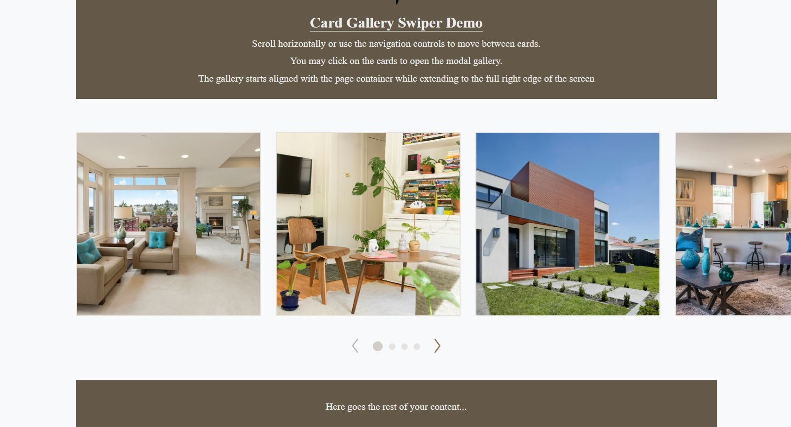
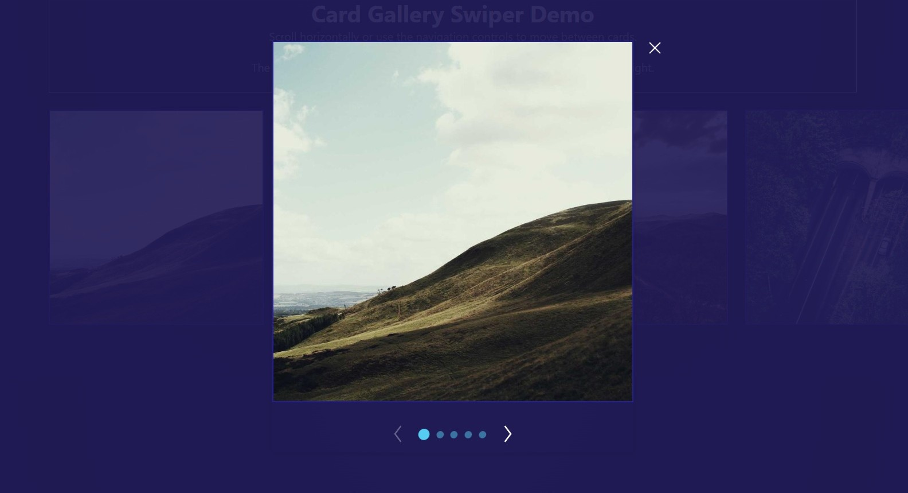

# Card Gallery Swiper

<p align="center">
  <a href="https://www.npmjs.com/package/card-gallery-swiper"></a>
  &nbsp;
  <a href="https://www.npmjs.com/package/card-gallery-swiper"></a>
  &nbsp;
  <a href="https://github.com/ArmineInants/card-gallery-swiper/blob/main/LICENSE"></a>
  &nbsp;
  
  &nbsp;
  
  &nbsp;
  
  &nbsp;
  <a href="https://bundlephobia.com/package/card-gallery-swiper"></a>
</p>

<p align="center">
  <strong>Horizontal card gallery</strong> with container alignment, edge-to-edge scroll, and an optional <strong>modal image viewer</strong>.
</p>

<p align="center">
  <a href="https://card-gallery-swiper.vercel.app/">Live demo</a>
  &nbsp;·&nbsp;
  <a href="https://www.npmjs.com/package/card-gallery-swiper">npm</a>
  &nbsp;·&nbsp;
  <a href="https://github.com/ArmineInants/card-gallery-swiper">GitHub</a>
  &nbsp;·&nbsp;
  <a href="https://github.com/ArmineInants/card-gallery-swiper/issues">Issues</a>
</p>

---

A React **card gallery swiper** with container-aligned layout, edge-to-edge scrolling and an optional **modal image gallery**. Built with **TypeScript** and **styled-components**, designed to be dropped into any React app.

### Demo

<p align="center">
  
  
</p>

The demo page renders **two variants**: `fullScreenMode` enabled (default) and `fullScreenMode={false}` (constrained by `containerMaxWidths`).

### Features

- **Container-aligned layout** – the gallery starts aligned with the page container while extending to the full right edge of the screen.
- **Edge-to-edge scrolling** – when scrolling, the gallery reaches the left edge of the viewport.
- **Built-in modal gallery** – click a card to open a focused image viewer with arrow navigation.
- **Customizable navigation** – configure arrow colors and progress indicators (shape, size, spacing, count).
- **Fully responsive** – breakpoints, card sizes, and spacing are all configurable via typed props.
- **Framework-agnostic** – works with Vite, CRA, Next.js, Remix, etc. (no framework-specific dependencies).

### Layout Behavior

The gallery is aligned with the page container on the left side while extending to the full width of the screen on the right.

When scrolling through items, the gallery smoothly reaches the left edge of the viewport, creating a modern edge-to-edge browsing experience commonly used in product and media galleries.

### Installation

```bash
npm install card-gallery-swiper
# or
yarn add card-gallery-swiper
```

Peer dependencies you should already have in your app:

- `react` / `react-dom`
- `styled-components`

#### Next.js

- **Styled-components + SSR:** Configure **styled-components for Next.js** (see [Next.js: styled-components](https://nextjs.org/docs/app/building-your-application/styling/css-in-js#styled-components)) so server and client markup match and you avoid hydration warnings and FOUC.

- **Modal stacking:** The modal gallery uses a **React portal** into `document.body`, so in Next.js (and elsewhere) it sits above app chrome (nav, drawers, layouts) and is not trapped by parent `transform` / `z-index` stacking contexts.

- **Optional — client-only import:** If you still see hydration issues or want this subtree client-only, load the component with `next/dynamic` and `ssr: false`:

```tsx
import dynamic from "next/dynamic";

const CardGallerySwiper = dynamic(
  () =>
    import("card-gallery-swiper").then((mod) => mod.CardGallerySwiper),
  { ssr: false },
);
```

Use `dynamic` only when needed; `ssr: false` means that part of the tree is not rendered on the server.

---

### Basic usage

```tsx
import React from 'react';
import { CardGallerySwiper } from 'card-gallery-swiper';

const images: Record<number, string> = {
  1: 'https://picsum.photos/seed/1/800/800',
  2: 'https://picsum.photos/seed/2/800/800',
  3: 'https://picsum.photos/seed/3/800/800',
  4: 'https://picsum.photos/seed/4/800/800',
  5: 'https://picsum.photos/seed/5/800/800',
};

export function Example() {
  return (
    <div style={{ padding: 24 }}>
      <CardGallerySwiper imageUrls={images} />
    </div>
  );
}
```

Clicking a card opens the **modal gallery**; use the arrows or dots to navigate.

---

### Advanced usage

Customize navigation styling and layout:

```tsx
<CardGallerySwiper
  imageUrls={images}
  pointsCountDefault={6}
  pointsType="square"
  pointSize={12}
  pointsGap={6}
  arrowColor="#56CCF2"
  arrowHoverColor="#9AE6FF"
  cardBorderWidth={3}
  cardBorderColor="#56CCF2"
  modalOverlayBlur={6}
  modalOverlayOpacity={0.9}
/>
```

This example:
- Uses 6 square progress indicators, slightly larger and closer together.
- Applies a custom accent color to card borders and navigation arrows.
- Adds a subtle blur and semi-transparent overlay behind the modal gallery.

---

### Props

All props are optional unless stated otherwise.

#### Core

| Prop          | Type                         | Default | Description |
|--------------|------------------------------|---------|-------------|
| `imageUrls`* | `Record<number, string>`     | –       | Map from index (starting at 1) to image URL. **Required.** |
| `withModal`  | `boolean`                    | `true`  | Whether clicking a card opens the modal gallery. |
| `fullScreenMode` | `boolean`                | `true` | When `true`, the gallery uses the full viewport width instead of being constrained by `containerMaxWidths`. |

#### Layout / responsiveness

| Prop                | Type              | Default                              | Description |
|---------------------|-------------------|--------------------------------------|-------------|
| `pointsCountDefault`   | `3 \| 4 \| 5 \| 6`| `5`                               | Number of progress dots. |
| `spaceBetween`      | `IBreakpoints`    | `{ mobile: 12, tablet: 24, laptop: 24, desktop: 24, large: 24 }` | Gap between cards per breakpoint (px). |
| `breakpoints`       | `IBreakpoints`    | `{ mobile: 360, tablet: 768, laptop: 1280, desktop: 1440, large: 1920 }` | Pixel widths for each device tier. |
| `containerMaxWidths`| `IBreakpoints`    | `{ mobile: 360, tablet: 688, laptop: 1040, desktop: 1128, large: 1440 }` | Max container width per breakpoint (px). Controls how wide the track can be at each breakpoint; together with `cardWidths` it determines how many cards fit per view. |
| `cardWidths`        | `IBreakpoints`    | `{ mobile: 288, tablet: 300, laptop: 300, desktop: 400, large: 400 }` | Card width per breakpoint (px). Combined with `containerMaxWidths`, this effectively defines the default `slidesPerView` at each breakpoint. |
| `cardHeights`       | `IBreakpoints`    | `{ mobile: 288, tablet: 300, laptop: 300, desktop: 400, large: 400 }` | Card height per breakpoint (px). |

#### Styling

| Prop            | Type                      | Default      | Description |
|-----------------|---------------------------|--------------|-------------|
| `className`     | `string`                  | –            | Class applied to the outer wrapper. |
| `cardClassName` | `string`                  | –            | Class applied to each card. |
| `cardBorderWidth` | `number`               | `2`          | Card border width (px). |
| `cardBorderColor` | `string`               | `#251f97`    | Card border color. |
| `cardShimmerColor` | `string`              | –            | Shimmer placeholder color while the card image loads. Defaults to `cardBorderColor`. |
| `arrowColor`    | `string`                  | `#2D2926`    | Color for navigation arrows in the swiper. |
| `arrowHoverColor` | `string`               | `#8C7355`    | Arrow color on hover in the swiper. |
| `navigationButtonSize` | `number`           | `42`         | Width and height (px) of the prev/next navigation hit areas in the main swiper and in the modal gallery. |
| `pointColor`    | `string`                  | `#D1CDC7`    | Active progress dot color in the swiper. |
| `pointsType`    | `'circle' \| 'square'`    | `'circle'`   | Shape of progress dots. |
| `pointSize`     | `number`                  | `10`         | Progress dot size (width/height, px). |
| `pointsGap`     | `number`                  | `10`         | Horizontal gap between dots (px). |

#### Modal overlay

| Prop                        | Type     | Default                               | Description |
|-----------------------------|----------|---------------------------------------|-------------|
| `modalBackgroundColor`      | `string` | `'transparent'`                       | Modal content background. |
| `modalOverlayColor`         | `string` | `'rgba(45, 41, 38, 0.85)'`           | Overlay background color. |
| `modalOverlayOpacity`       | `number` | `1`                                   | Overlay opacity when open. |
| `modalOverlayBlur`          | `number` | `5`                                   | Overlay blur in pixels. |
| `modalOverlayShadow`        | `string` | `'none'`                              | Box-shadow for modal content. |
| `modalOverlayTransition`    | `string` | `'all 0.3s ease-in-out'`             | CSS transition for overlay. |
| `modalOverlayTransitionDuration` | `number` | `300`                           | Transition duration in ms. |
| `modalArrowColor`           | `string` | `'#FFFFFF'`                          | Color for navigation arrows inside the modal gallery. |
| `modalArrowHoverColor`      | `string` | `'#D4AF37'`                          | Hover color for modal navigation arrows. |
| `modalPointColor`           | `string` | `'rgba(255, 255, 255, 0.3)'`         | Active progress dot color in the modal gallery. |
| `modalClassName`            | `string` | `''`                                  | Class name applied to the modal overlay (full-screen backdrop). |
| `modalExitClassName`        | `string` | `''`                                  | Class name applied to the modal close (exit) button. |
| `modalImageWidths`          | `IBreakpoints` | `{ mobile: 328, tablet: 504, laptop: 504, desktop: 504, large: 504 }` | Modal image width per breakpoint (px). |
| `modalImageHeights`         | `IBreakpoints` | `{ mobile: 328, tablet: 504, laptop: 504, desktop: 504, large: 504 }` | Modal image height per breakpoint (px). |

`IBreakpoints` is:

```ts
export interface IBreakpoints {
  mobile: number;
  tablet: number;
  laptop: number;
  desktop: number;
  large: number;
}
```

---

### Development

Run the demo locally:

```bash
npm install
npm run dev
```

Build the library:

```bash
npm run build
```

---

### License

MIT

